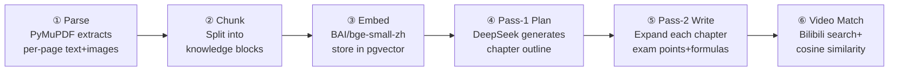
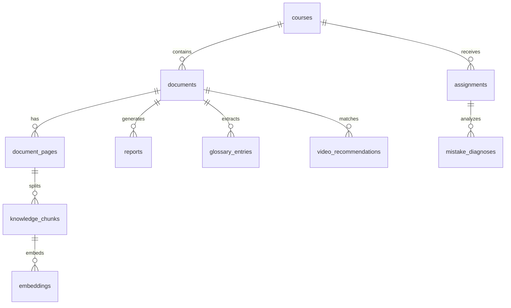

# CoursePulse AI

Turn sleepy lecture slides into a personal TA report.
Upload a PDF, get a structured study report: topic-organized notes, glossary, and relevant Bilibili teaching videos.

**[Live Demo](https://coursepulse-ai.railway.app)** · [中文](README.md)

---

## What it does

CoursePulse AI turns a lecture-slide PDF into a structured study report: organized by topic, surfacing exam points and common mistakes, with formulas, diagrams, and relevant teaching videos pulled from Bilibili. Built for students drowning in slides.

## Status

✅ PDF parsing + two-pass LLM note generation
✅ Semantic embeddings + Bilibili video recommendations
🚧 Homework diagnosis — Vision identifies mistakes and links back to slides
🚧 Pre-exam review report — weighted topic map + cheat sheet

## Architecture

```
Browser
  │
  ▼
┌──────────────────┐
│  Next.js Frontend │  shadcn/ui + Tailwind
│  (port 3000)      │
└────────┬─────────┘
         │ REST API
         ▼
┌──────────────────┐
│  FastAPI Backend  │
│  (port 8000)      │
│                   │
│  Sync routes:     │  uploads, queries, glossary, video search
│  BackgroundTasks: │  PDF parsing, report gen, diagnosis
└────────┬─────────┘
         │
    ┌────┴────┐
    ▼         ▼
┌────────┐  ┌──────────┐
│Postgres │  │ DeepSeek │
│pgvector │  │ Chat API │
│ (5432)  │  │ + BAAI   │
└────────┘  │ Embedding│
            └──────────┘
```

### Core Pipeline

After a user uploads a PDF, the backend generates a full report in 6 steps:



### Key Design Decisions

| Decision | Choice | Rationale |
|----------|--------|-----------|
| LLM | DeepSeek Chat | Strong Chinese STEM output, fraction of GPT-4o cost |
| Embedding | BAAI/bge-small-zh-v1.5 | Chinese semantic matching outperforms OpenAI English models |
| Report generation | Two-pass (plan → write) | Single-pass often drops chapters or loses structure |
| Video recommendations | Bilibili scraper + vector similarity | No official API; cosine similarity filters noise |
| Vector storage | pgvector | Reuses Postgres, no extra infrastructure |
| Async tasks | FastAPI BackgroundTasks | Single-user scenario, avoids Celery/Redis complexity |
| Rate limiting | In-memory counter + BYOK bypass | No Redis needed; BYOK users bring their own key |

### Database Schema



Visual explainer: [`/architecture`](https://coursepulse-ai.railway.app/architecture).

## Run locally in 5 minutes

Prereqs: Docker Desktop, a DeepSeek API key.

```bash
git clone https://github.com/CarterJia/Coursepulse-AI.git
cd Coursepulse-AI
cp .env.example .env   # edit .env and set DEEPSEEK_API_KEY
docker compose up
```

Open http://localhost:3000.

## Bring your own key

The Live Demo allows 3 free uploads per IP per day. To run more, click "Use my own API key" at the bottom of the upload area and paste your DeepSeek key. The key lives in your browser's localStorage only — it never hits our server logs.

## Stack

- Next.js 15 / TypeScript / Tailwind / shadcn/ui
- FastAPI / SQLAlchemy / Alembic
- Postgres 16 / pgvector
- DeepSeek Chat / BAAI/bge-small-zh-v1.5
- Docker Compose / Railway

## License

MIT
