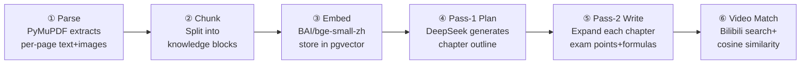
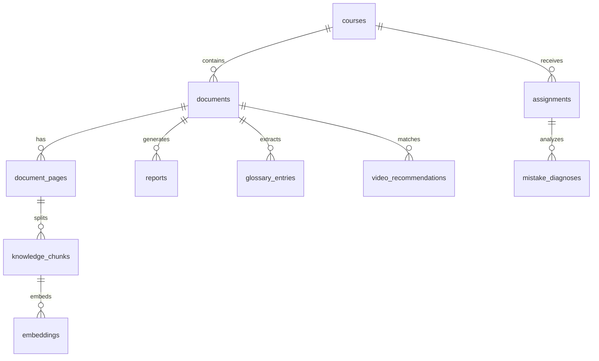

# CoursePulse AI

An AI study tool for international students — upload lecture slides as PDF, get structured Chinese study notes, glossary, and relevant teaching video recommendations.

**[Live Demo](https://coursepulse-ai.railway.app)** · [中文](README.md)

---

## The Problem

International STEM students face a common challenge: dense English-language slides, fast-paced lectures, and limited native-language study resources after class. CoursePulse AI turns a single lecture PDF into a complete Chinese study report:

1. **Upload slides** — drop a PDF, the system parses every page's text, formulas, and diagrams
2. **AI-generated notes** — organized by topic, each chapter expanded into clear Chinese notes with exam points, common mistakes, and key formulas
3. **Glossary** — automatically extracts technical terms with Chinese definitions and plain-language analogies
4. **Video recommendations** — matches each chapter's topic to relevant short videos from Bilibili
5. **Homework diagnosis** (in development) — upload graded assignments, AI identifies mistakes and links back to the relevant slide content
6. **Exam review** (in development) — combines slide coverage and mistake frequency to generate a review priority map and cheat sheet

## Status

- ✅ PDF parsing + two-pass LLM note generation
- ✅ Semantic embeddings + Bilibili video recommendations
- 🚧 Homework diagnosis — Vision identifies mistakes and links back to slides
- 🚧 Pre-exam review report — weighted topic map + cheat sheet

## Architecture

```
Browser
  │
  ▼
┌──────────────────┐
│  Next.js Frontend │  shadcn/ui + Tailwind
│  (port 3000)      │
└────────┬─────────┘
         │ REST API
         ▼
┌──────────────────┐
│  FastAPI Backend  │
│  (port 8000)      │
│                   │
│  Sync routes:     │  uploads, queries, glossary, video search
│  BackgroundTasks: │  PDF parsing, report gen, diagnosis
└────────┬─────────┘
         │
    ┌────┴────┐
    ▼         ▼
┌────────┐  ┌──────────┐
│Postgres │  │ DeepSeek │
│pgvector │  │ Chat API │
│ (5432)  │  │ + BAAI   │
└────────┘  │ Embedding│
            └──────────┘
```

### Core Pipeline

After a user uploads a PDF, the backend generates a full report in 6 steps:



### Key Design Decisions

| Decision | Choice | Rationale |
|----------|--------|-----------|
| LLM | DeepSeek Chat | Strong Chinese STEM output, fraction of GPT-4o cost |
| Embedding | BAAI/bge-small-zh-v1.5 | Chinese semantic matching outperforms OpenAI English models |
| Report generation | Two-pass (plan → write) | Single-pass often drops chapters or loses structure |
| Video recommendations | Bilibili scraper + vector similarity | No official API; cosine similarity filters noise |
| Vector storage | pgvector | Reuses Postgres, no extra infrastructure |
| Async tasks | FastAPI BackgroundTasks | Single-user scenario, avoids Celery/Redis complexity |
| Rate limiting | In-memory counter + BYOK bypass | No Redis needed; BYOK users bring their own key |

### Database Schema



Visual explainer: [`/architecture`](https://coursepulse-ai.railway.app/architecture).

## Getting Started

### Option 1: Live Demo (no install)

1. Open **[Live Demo](https://coursepulse-ai.railway.app)**
2. Upload a lecture PDF (3 free uploads per IP per day)
3. Wait 1–3 minutes — the page polls for progress and redirects to the report when ready
4. For unlimited uploads: click **"Use my own API key"** below the upload area, paste your [DeepSeek API key](https://platform.deepseek.com/api_keys) — the key stays in your browser's localStorage only, never touches server logs

### Option 2: Run locally

**Prerequisites:** [Docker Desktop](https://www.docker.com/products/docker-desktop/) (must be running), a [DeepSeek API key](https://platform.deepseek.com/api_keys)

```bash
# 1. Clone the repo
git clone https://github.com/CarterJia/Coursepulse-AI.git
cd Coursepulse-AI

# 2. Configure environment
cp .env.example .env
# Open .env and replace DEEPSEEK_API_KEY=sk-your-deepseek-key-here with your real key

# 3. Start all services (first build takes ~3–5 minutes)
docker compose up
```

You'll know it's ready when you see:
```
backend  | [cleanup] Storage cleanup complete. Root: /app/storage
backend  | INFO:     Uvicorn running on http://0.0.0.0:8000
frontend | ▲ Next.js 15.x
frontend |   - Local: http://0.0.0.0:3000
```

4. Open http://localhost:3000
5. Upload any lecture PDF and wait for the progress indicator to complete (typically 1–3 minutes depending on page count and DeepSeek API latency)
6. Once ready, you'll be redirected to the report — topic-organized Chinese notes, glossary cards, and Bilibili video recommendations

## Stack

- Next.js 15 / TypeScript / Tailwind / shadcn/ui
- FastAPI / SQLAlchemy / Alembic
- Postgres 16 / pgvector
- DeepSeek Chat / BAAI/bge-small-zh-v1.5
- Docker Compose / Railway

## License

MIT
