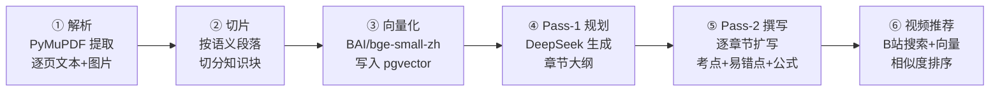
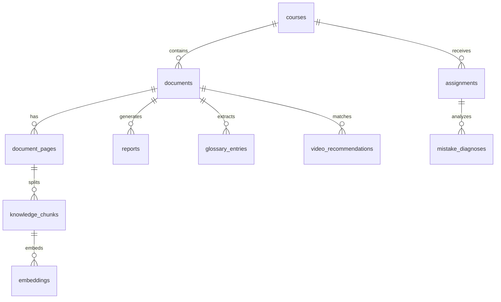

# CoursePulse AI

一个面向海外留学生的 AI 学习工具——上传课件 PDF，自动生成结构化中文讲义、术语百科和相关教学视频推荐。

**[Live Demo](https://coursepulse-ai.railway.app)** · [English](README.en.md)

---

## 解决什么问题

海外理工科留学生面临一个共同痛点：英文课件信息密度高、课堂节奏快，课后缺乏中文辅导资源。CoursePulse AI 让你把一份课件 PDF 变成一份完整的中文学习报告：

1. **上传课件** — 拖入一份 PDF，系统自动解析每一页的文字、公式和图表
2. **AI 生成讲义** — 按主题分章节，逐章扩写为易懂的中文讲义，标注考点、易错点和关键公式
3. **术语百科** — 自动提取专业术语，给出中文定义和通俗类比
4. **视频推荐** — 根据每章主题从 B 站匹配高相关度的短视频，辅助理解抽象概念
5. **错题诊断**（开发中）— 上传批改后的作业截图，AI 识别错误并回链到对应课件知识点
6. **考前复习**（开发中）— 综合课件权重和错题频率，生成复习优先级地图和 Cheat Sheet

## 功能状态

- ✅ PDF 解析 + 两阶段 LLM 讲义生成
- ✅ 语义向量 + B 站视频推荐
- 🚧 错题诊断 — Vision 识别错误并回链课件
- 🚧 考前复习报告 — 权重地图 + Cheat Sheet

## 架构

```
Browser
  │
  ▼
┌──────────────────┐
│  Next.js Frontend │  shadcn/ui + Tailwind
│  (port 3000)      │
└────────┬─────────┘
         │ REST API
         ▼
┌──────────────────┐
│  FastAPI Backend  │
│  (port 8000)      │
│                   │
│  Sync routes:     │  uploads, queries, glossary, video search
│  BackgroundTasks: │  PDF parsing, report gen, diagnosis
└────────┬─────────┘
         │
    ┌────┴────┐
    ▼         ▼
┌────────┐  ┌──────────┐
│Postgres │  │ DeepSeek │
│pgvector │  │ Chat API │
│ (5432)  │  │ + BAAI   │
└────────┘  │ Embedding│
            └──────────┘
```

### 核心流水线

用户上传一份 PDF 后，后端按以下 6 步生成完整报告：



### 关键设计决策

| 决策 | 选择 | 理由 |
|------|------|------|
| LLM | DeepSeek Chat | 中文理科内容质量高，成本低于 GPT-4o |
| Embedding | BAAI/bge-small-zh-v1.5 | 中文语义匹配优于 OpenAI 英文模型 |
| 报告生成 | 两阶段（规划→撰写）| 单次生成容易遗漏章节或结构混乱 |
| 视频推荐 | B 站爬虫 + 向量相似度 | 无官方 API；余弦相似度过滤噪声 |
| 向量存储 | pgvector | 不引入额外基础设施，复用 Postgres |
| 异步任务 | FastAPI BackgroundTasks | 单用户场景，避免 Celery/Redis 复杂度 |
| 配额控制 | 内存计数 + BYOK 旁路 | 无需 Redis；BYOK 用户自带 key 不受限 |

### 数据库核心表



可视化讲解：访问 [`/architecture`](https://coursepulse-ai.railway.app/architecture) 页。

## 使用流程

### 方式一：在线 Demo（无需安装）

1. 打开 **[Live Demo](https://coursepulse-ai.railway.app)**
2. 直接上传一份课件 PDF（每个 IP 每天 3 次免费额度）
3. 等待 1–3 分钟，页面会自动轮询处理进度，完成后跳转到报告页
4. 想要无限次使用：点击上传区下方 **"Use my own API key"**，填入你的 [DeepSeek API key](https://platform.deepseek.com/api_keys)，即可绕过配额限制（key 仅存于浏览器 localStorage，不会传到服务端日志）

### 方式二：本地部署

**前置条件：** [Docker Desktop](https://www.docker.com/products/docker-desktop/)（确保已启动）、一个 [DeepSeek API key](https://platform.deepseek.com/api_keys)

```bash
# 1. 克隆仓库
git clone https://github.com/CarterJia/Coursepulse-AI.git
cd Coursepulse-AI

# 2. 配置环境变量
cp .env.example .env
# 用编辑器打开 .env，把 DEEPSEEK_API_KEY=sk-your-deepseek-key-here 替换成你的真实 key

# 3. 启动所有服务（首次构建约 3–5 分钟）
docker compose up
```

看到以下日志说明启动成功：
```
backend  | [cleanup] Storage cleanup complete. Root: /app/storage
backend  | INFO:     Uvicorn running on http://0.0.0.0:8000
frontend | ▲ Next.js 15.x
frontend |   - Local: http://0.0.0.0:3000
```

4. 打开 http://localhost:3000
5. 上传任意 PDF 课件，等待进度条完成（通常 1–3 分钟，取决于课件页数和 DeepSeek API 响应速度）
6. 报告生成后自动跳转——你会看到按主题分段的中文讲义、术语卡片和 B 站视频推荐

## 技术栈

- Next.js 15 / TypeScript / Tailwind / shadcn/ui
- FastAPI / SQLAlchemy / Alembic
- Postgres 16 / pgvector
- DeepSeek Chat / BAAI/bge-small-zh-v1.5
- Docker Compose / Railway

## License

MIT
