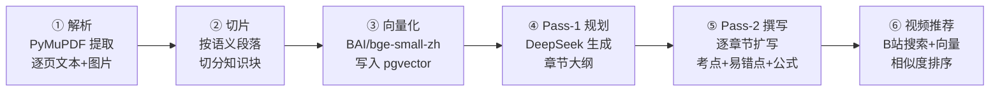
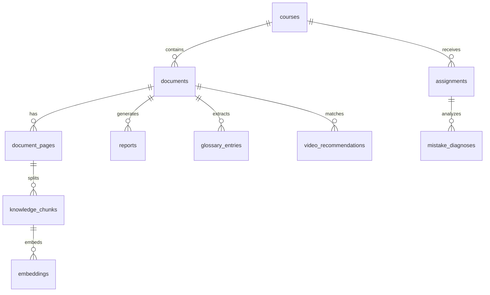

# CoursePulse AI

Turn sleepy lecture slides into a personal TA report.
上传 PDF，自动产出结构化讲义、术语百科、相关教学视频。

**[Live Demo](https://coursepulse-ai.railway.app)** · [English](README.en.md)

---

## 做什么

CoursePulse AI 把课件 PDF 转成一份结构化的学习报告：按主题分段、抽取考点与易错点、配套公式与示意图、并从 B 站挑出相关教学视频。面向课业重、错过直播的大学生。

## 功能状态

✅ PDF 解析 + 两阶段 LLM 讲义生成
✅ 语义向量 + B 站视频推荐
🚧 错题诊断 — Vision 识别错误并回链课件
🚧 考前复习报告 — 权重地图 + Cheat Sheet

## 架构

```
Browser
  │
  ▼
┌──────────────────┐
│  Next.js Frontend │  shadcn/ui + Tailwind
│  (port 3000)      │
└────────┬─────────┘
         │ REST API
         ▼
┌──────────────────┐
│  FastAPI Backend  │
│  (port 8000)      │
│                   │
│  Sync routes:     │  uploads, queries, glossary, video search
│  BackgroundTasks: │  PDF parsing, report gen, diagnosis
└────────┬─────────┘
         │
    ┌────┴────┐
    ▼         ▼
┌────────┐  ┌──────────┐
│Postgres │  │ DeepSeek │
│pgvector │  │ Chat API │
│ (5432)  │  │ + BAAI   │
└────────┘  │ Embedding│
            └──────────┘
```

### 核心流水线

用户上传一份 PDF 后，后端按以下 6 步生成完整报告：



### 关键设计决策

| 决策 | 选择 | 理由 |
|------|------|------|
| LLM | DeepSeek Chat | 中文理科内容质量高，成本低于 GPT-4o |
| Embedding | BAAI/bge-small-zh-v1.5 | 中文语义匹配优于 OpenAI 英文模型 |
| 报告生成 | 两阶段（规划→撰写）| 单次生成容易遗漏章节或结构混乱 |
| 视频推荐 | B 站爬虫 + 向量相似度 | 无官方 API；余弦相似度过滤噪声 |
| 向量存储 | pgvector | 不引入额外基础设施，复用 Postgres |
| 异步任务 | FastAPI BackgroundTasks | 单用户场景，避免 Celery/Redis 复杂度 |
| 配额控制 | 内存计数 + BYOK 旁路 | 无需 Redis；BYOK 用户自带 key 不受限 |

### 数据库核心表



可视化讲解：访问 [`/architecture`](https://coursepulse-ai.railway.app/architecture) 页。

## 5 分钟本地跑通

前置：Docker Desktop、一个 DeepSeek API key。

```bash
git clone https://github.com/CarterJia/Coursepulse-AI.git
cd Coursepulse-AI
cp .env.example .env   # 编辑 .env 填入 DEEPSEEK_API_KEY
docker compose up
```

打开 http://localhost:3000 即可使用。

## Bring your own key

Live Demo 默认每个 IP 每天 3 次免费上传。想跑更多：在首页右下点 "Use my own API key"，填入自己的 DeepSeek API key 即可解锁无限次。

key 只存在你浏览器的 localStorage，不会写入我们的数据库或日志。

## 技术栈

- Next.js 15 / TypeScript / Tailwind / shadcn/ui
- FastAPI / SQLAlchemy / Alembic
- Postgres 16 / pgvector
- DeepSeek Chat / BAAI/bge-small-zh-v1.5
- Docker Compose / Railway

## License

MIT
